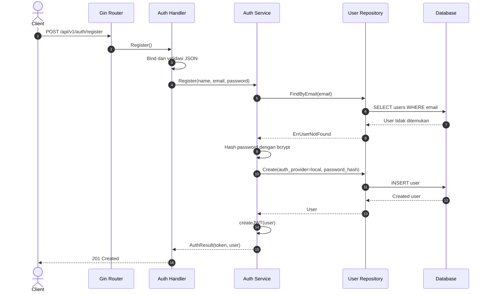
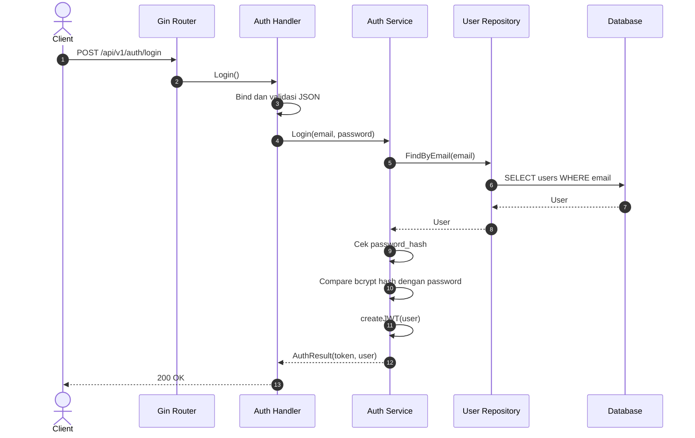
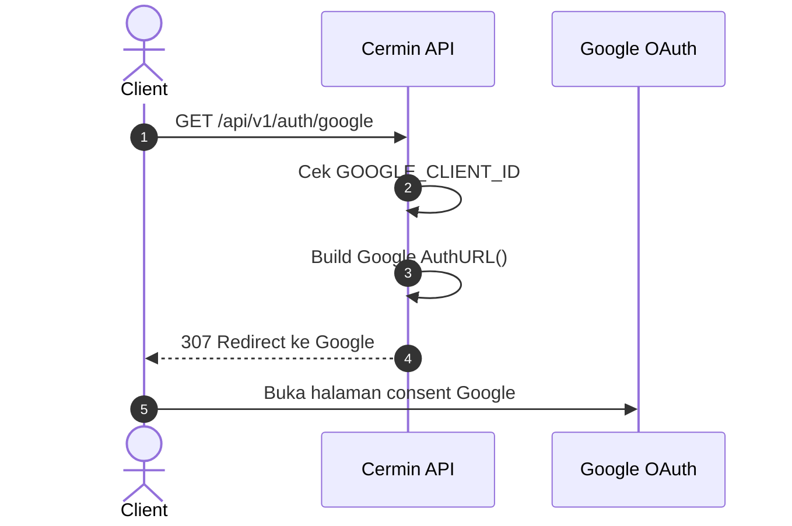
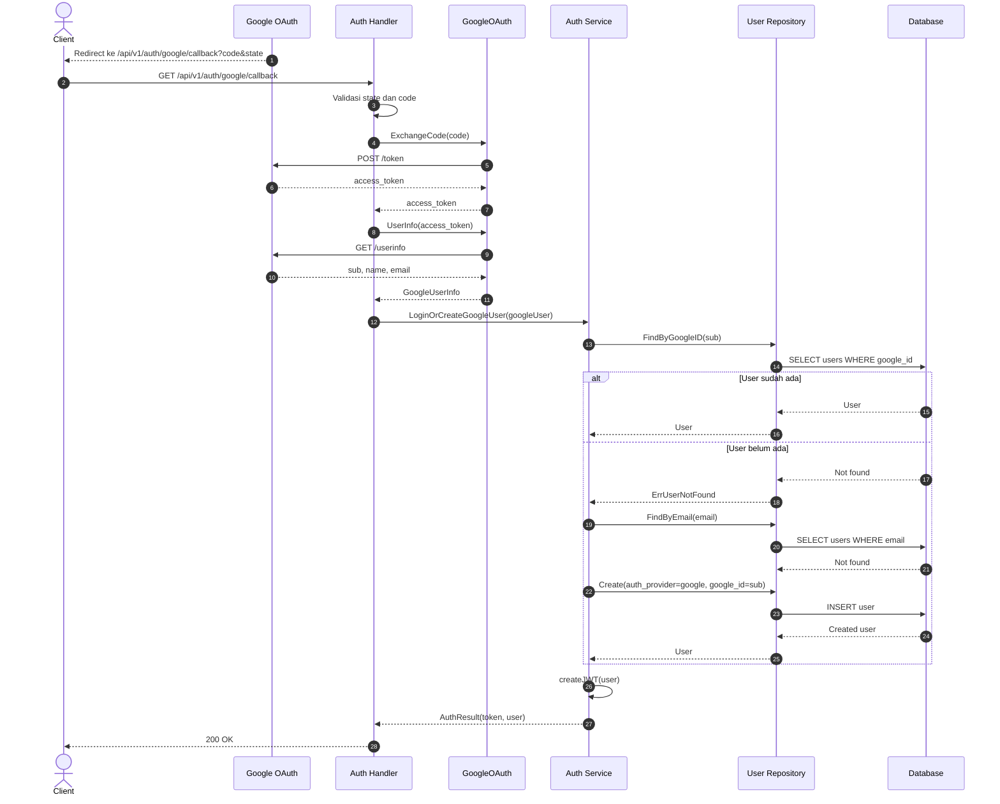
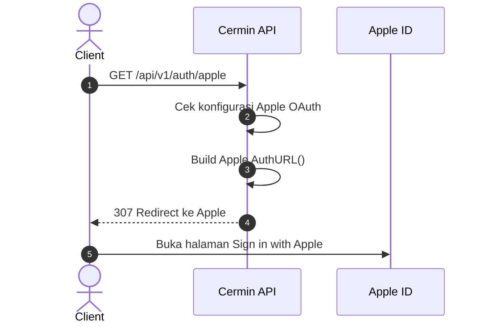
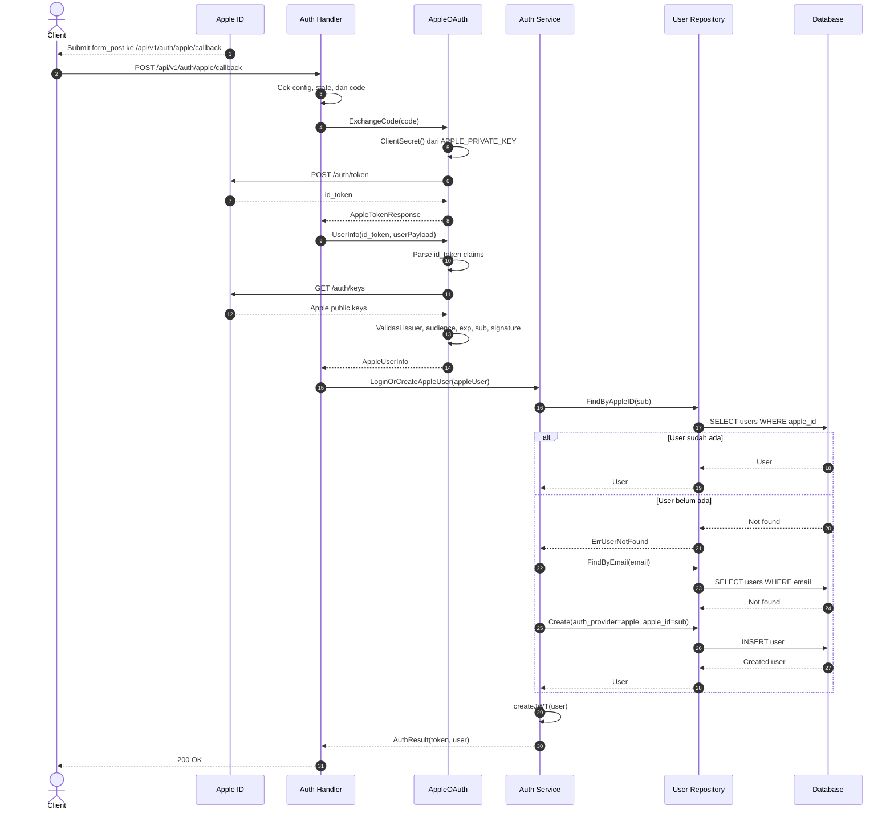

# Alur Authentication

Dokumen ini menjelaskan cara kerja authentication di `internal/auth/`, mencakup normal auth, Google OAuth, dan Apple OAuth.

## Komponen Utama

- `internal/router/router.go`: mendaftarkan endpoint auth.
- `internal/auth/handler.go`: menerima HTTP request, validasi request dasar, lalu memanggil service atau OAuth client.
- `internal/auth/service.go`: berisi business logic auth, pembuatan user, login user, dan pembuatan JWT.
- `internal/auth/google.go`: membuat Google OAuth URL, exchange authorization code, dan mengambil Google user info.
- `internal/auth/apple.go`: membuat Apple OAuth URL, membuat Apple client secret dari `.p8`, exchange authorization code, validasi `id_token`, dan mengambil Apple user info.
- `internal/user/repository.go`: akses database untuk mencari atau membuat user.
- `internal/user/model.go`: model user dengan provider local, google, atau apple.

## Endpoint Auth

| Method | Path | Keterangan |
| --- | --- | --- |
| `POST` | `/api/v1/auth/register` | Membuat akun normal dengan email dan password. |
| `POST` | `/api/v1/auth/login` | Login normal dengan email dan password. |
| `GET` | `/api/v1/auth/google` | Redirect user ke halaman consent Google. |
| `GET` | `/api/v1/auth/google/callback` | Callback Google setelah user approve. |
| `GET` | `/api/v1/auth/apple` | Redirect user ke halaman Sign in with Apple. |
| `GET` | `/api/v1/auth/apple/callback` | Callback Apple via query parameter. |
| `POST` | `/api/v1/auth/apple/callback` | Callback Apple via `form_post`. Ini flow utama Apple saat `response_mode=form_post`. |

## Response Berhasil

Semua flow yang sukses akan mengembalikan format yang sama:

```json
{
  "token": "jwt-token",
  "user": {
    "id": 1,
    "name": "User Name",
    "email": "user@example.com",
    "auth_provider": "local"
  }
}
```

Nilai `auth_provider` bisa berupa:

- `local`
- `google`
- `apple`

JWT dibuat di `Service.createJWT()` dengan payload:

- `sub`: user ID
- `email`: email user
- `iat`: waktu token dibuat
- `exp`: waktu token expired, saat ini 24 jam setelah dibuat

## Normal Auth

Normal auth terdiri dari register dan login. Keduanya memakai email dan password.

### Register

Endpoint:

```text
POST /api/v1/auth/register
```

Request body:

```json
{
  "name": "Budi",
  "email": "budi@example.com",
  "password": "password123"
}
```

Alur:

1. `Handler.Register()` membaca JSON request.
2. Gin melakukan validasi:
   - `name` wajib ada.
   - `email` wajib ada dan formatnya email.
   - `password` minimal 8 karakter.
3. `Service.Register()` mencari user berdasarkan email.
4. Jika email sudah dipakai, return `409 Conflict`.
5. Password di-hash dengan bcrypt.
6. User dibuat dengan:
   - `auth_provider = local`
   - `password_hash` berisi hash bcrypt
7. Service membuat JWT.
8. API mengembalikan `201 Created`.



### Login

Endpoint:

```text
POST /api/v1/auth/login
```

Request body:

```json
{
  "email": "budi@example.com",
  "password": "password123"
}
```

Alur:

1. `Handler.Login()` membaca JSON request.
2. Gin melakukan validasi email dan password.
3. `Service.Login()` mencari user berdasarkan email.
4. Jika user tidak ada, return `401 Unauthorized`.
5. Jika user tidak punya `password_hash`, berarti user berasal dari OAuth, return `401 Unauthorized`.
6. Password dibandingkan dengan bcrypt.
7. Jika cocok, service membuat JWT.
8. API mengembalikan `200 OK`.



## Google Auth

Google auth memakai OAuth authorization code flow.

Env yang dipakai:

```env
GOOGLE_CLIENT_ID=
GOOGLE_CLIENT_SECRET=
GOOGLE_REDIRECT_URL=
GOOGLE_OAUTH_STATE=
```

### Start Google OAuth

Endpoint:

```text
GET /api/v1/auth/google
```

Alur:

1. `Handler.GoogleRedirect()` memastikan `GOOGLE_CLIENT_ID` tersedia.
2. `GoogleOAuth.AuthURL()` membuat URL ke Google:
   - `client_id`
   - `redirect_uri`
   - `response_type=code`
   - `scope=openid email profile`
   - `state`
   - `access_type=offline`
   - `prompt=consent`
3. API redirect ke Google dengan status `307 Temporary Redirect`.



### Google Callback

Endpoint:

```text
GET /api/v1/auth/google/callback?code=...&state=...
```

Alur:

1. Google redirect user ke callback dengan `code` dan `state`.
2. `Handler.GoogleCallback()` membandingkan query `state` dengan `GOOGLE_OAUTH_STATE`.
3. Jika state salah, return `400 Bad Request`.
4. Jika `code` kosong, return `400 Bad Request`.
5. `GoogleOAuth.ExchangeCode()` mengirim `code` ke Google token endpoint.
6. Google mengembalikan `access_token`.
7. `GoogleOAuth.UserInfo()` mengambil profile user dari Google userinfo endpoint.
8. `Service.LoginOrCreateGoogleUser()` mencari user berdasarkan `google_id`.
9. Jika user ditemukan, langsung buat JWT.
10. Jika user belum ada, service cek apakah email sudah dipakai user lain.
11. Jika email sudah dipakai, return `409 Conflict`.
12. Jika email belum dipakai, buat user dengan:
    - `auth_provider = google`
    - `google_id = sub dari Google`
13. Service membuat JWT.
14. API mengembalikan `200 OK`.



## Apple Auth

Apple auth juga memakai OAuth authorization code flow, tetapi ada beberapa hal khusus:

- Redirect menggunakan `response_mode=form_post`.
- Callback utama Apple adalah `POST /api/v1/auth/apple/callback`.
- Backend membuat `client_secret` sendiri dalam bentuk JWT ES256 memakai `.p8` private key.
- Backend memvalidasi `id_token` dari Apple dengan public key Apple.
- Data `name` dari Apple biasanya hanya dikirim pada login pertama.

Env yang dipakai:

```env
APPLE_CLIENT_ID=
APPLE_TEAM_ID=
APPLE_KEY_ID=
APPLE_PRIVATE_KEY=
APPLE_REDIRECT_URL=
APPLE_OAUTH_STATE=
```

### Start Apple OAuth

Endpoint:

```text
GET /api/v1/auth/apple
```

Alur:

1. `Handler.AppleRedirect()` memastikan Apple OAuth sudah lengkap:
   - `APPLE_CLIENT_ID`
   - `APPLE_TEAM_ID`
   - `APPLE_KEY_ID`
   - `APPLE_PRIVATE_KEY`
   - `APPLE_REDIRECT_URL`
2. `AppleOAuth.AuthURL()` membuat URL ke Apple:
   - `client_id`
   - `redirect_uri`
   - `response_type=code`
   - `response_mode=form_post`
   - `scope=name email`
   - `state`
3. API redirect ke Apple dengan status `307 Temporary Redirect`.



### Apple Callback

Endpoint:

```text
POST /api/v1/auth/apple/callback
```

Apple juga didukung lewat `GET /api/v1/auth/apple/callback`, tetapi flow utama dari `response_mode=form_post` adalah `POST`.

Alur:

1. Apple mengirim callback ke backend dengan form field:
   - `code`
   - `state`
   - `user`, biasanya hanya pada authorization pertama
2. `Handler.AppleCallback()` memastikan Apple OAuth sudah terkonfigurasi.
3. Handler mengambil nilai callback dari form body atau query string.
4. Handler membandingkan `state` dengan `APPLE_OAUTH_STATE`.
5. Jika state salah, return `400 Bad Request`.
6. Jika `code` kosong, return `400 Bad Request`.
7. `AppleOAuth.ExchangeCode()` membuat `client_secret`.
8. `client_secret` dibuat dengan JWT ES256:
   - header `alg=ES256`
   - header `kid=APPLE_KEY_ID`
   - claim `iss=APPLE_TEAM_ID`
   - claim `aud=https://appleid.apple.com`
   - claim `sub=APPLE_CLIENT_ID`
   - claim `exp=now + 180 hari`
9. Backend exchange `code` ke Apple token endpoint.
10. Apple mengembalikan `id_token`.
11. `AppleOAuth.UserInfo()` memvalidasi `id_token`.
12. Validasi token mencakup:
    - issuer harus `https://appleid.apple.com`
    - audience harus sama dengan `APPLE_CLIENT_ID`
    - token belum expired
    - subject wajib ada
    - signature valid memakai Apple public keys
13. Backend mengambil user info:
    - `sub` dari `id_token` menjadi `apple_id`
    - email dari payload `user` atau dari claim `email`
    - name dari payload `user`, atau fallback ke local-part email
14. `Service.LoginOrCreateAppleUser()` mencari user berdasarkan `apple_id`.
15. Jika user ditemukan, langsung buat JWT.
16. Jika user belum ada, service cek apakah email sudah dipakai user lain.
17. Jika email sudah dipakai, return `409 Conflict`.
18. Jika email belum dipakai, buat user dengan:
    - `auth_provider = apple`
    - `apple_id = sub dari Apple`
19. Service membuat JWT.
20. API mengembalikan `200 OK`.



## Error yang Umum Terjadi

| Kondisi | Response |
| --- | --- |
| Body register/login tidak valid | `400 Bad Request` |
| Email register sudah dipakai | `409 Conflict` |
| Login email/password salah | `401 Unauthorized` |
| OAuth belum dikonfigurasi | `500 Internal Server Error` |
| OAuth state tidak cocok | `400 Bad Request` |
| OAuth callback tidak membawa `code` | `400 Bad Request` |
| Exchange token ke provider gagal | `502 Bad Gateway` |
| Email dari OAuth sudah dipakai akun lain | `409 Conflict` |

## Catatan Penting

- User normal menyimpan `password_hash`.
- User Google menyimpan `google_id` dan tidak punya `password_hash`.
- User Apple menyimpan `apple_id` dan tidak punya `password_hash`.
- Login normal akan menolak user OAuth karena `password_hash` bernilai `nil`.
- OAuth Google dan Apple tidak menggabungkan akun otomatis berdasarkan email. Jika email sudah ada dari provider lain, API mengembalikan `409 Conflict`.
- Untuk Apple, endpoint return URL di Apple Developer harus sama dengan:

```text
https://cermin-api.tiarlab.com/api/v1/auth/apple/callback
```

- Setelah menambah Apple auth, database perlu migration untuk kolom `apple_id`:

```bash
make migrate-up
```
