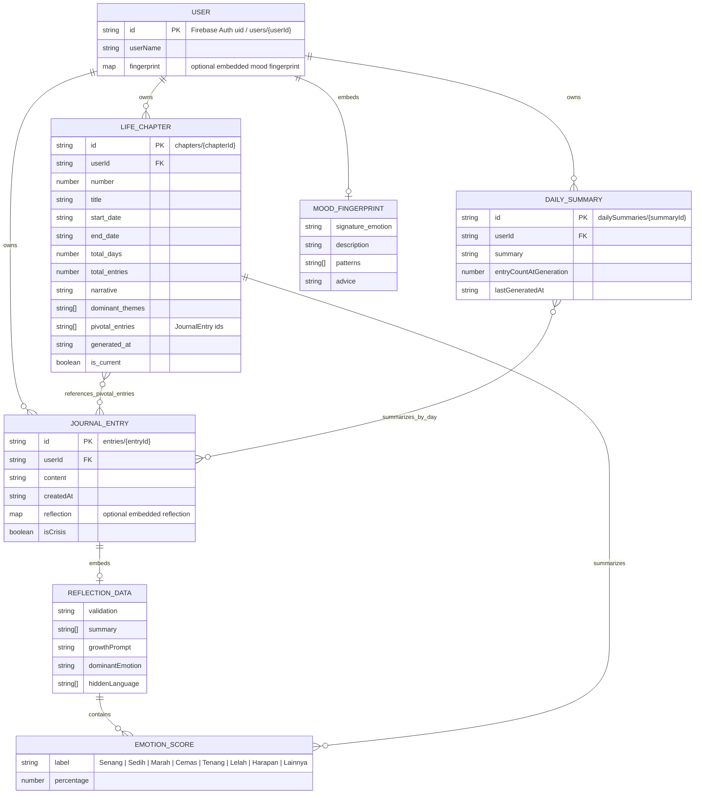

# Cermin ERD

This ERD is based on the current Firestore structure, security rules, and TypeScript models in the app.



## Firestore Paths

```text
users/{userId}
users/{userId}/entries/{entryId}
users/{userId}/chapters/{chapterId}
users/{userId}/dailySummaries/{summaryId}
```

## Relationship Notes

- `User` is the root owner for all persisted app data.
- `JournalEntry`, `LifeChapter`, and `DailySummary` are stored as subcollections under `users/{userId}`.
- `ReflectionData` is embedded inside a journal entry, not stored as a separate collection.
- `EmotionScore` is embedded inside `ReflectionData` and `LifeChapter`.
- `MoodFingerprint` is modeled as optional embedded data on the user document, although the current UI also caches fingerprint data in `localStorage`.
- `LifeChapter.pivotal_entries` stores journal entry IDs, creating a logical many-to-many reference to `JournalEntry`.
- `DailySummary` summarizes entries for a day, but it does not currently store explicit entry IDs.
