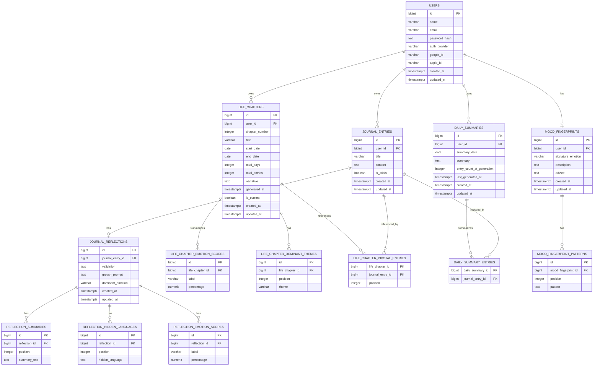

# Cermin Relational Database ERD

This document converts the previous Firestore-style ERD into a normalized relational database design for PostgreSQL.

The current backend already has a `users` table using `BIGSERIAL` IDs, so this design follows that convention. Firestore document IDs become relational primary keys, embedded maps become child tables, and arrays become one-to-many child tables or join tables.

## Relational ERD



## Tables

### users

Function: Stores one application account. All journal, chapter, daily summary, and mood fingerprint data belongs to a user.

Relationship function:

- One user can have many journal entries.
- One user can have many life chapters.
- One user can have many daily summaries.
- One user can have zero or one mood fingerprint.

| Column | Type | Key | Nullable | Explanation |
|---|---:|---|---|---|
| `id` | `BIGSERIAL` | PK | No | Internal relational user identifier. This replaces the Firestore `users/{userId}` document path as the parent key. |
| `name` | `VARCHAR(100)` |  | No | User display name. This maps to the previous `userName` field. |
| `email` | `VARCHAR(150)` | UNIQUE | No | User email address, used for login and account identity. |
| `password_hash` | `TEXT` |  | Yes | Hashed password for local email/password accounts. It is empty for OAuth-only accounts. |
| `auth_provider` | `VARCHAR(30)` |  | No | Login provider, such as `local`, `google`, or `apple`. |
| `google_id` | `VARCHAR(255)` | UNIQUE | Yes | Stable Google account identifier for Google sign-in users. |
| `apple_id` | `VARCHAR(255)` | UNIQUE | Yes | Stable Apple account identifier for Apple sign-in users. |
| `created_at` | `TIMESTAMPTZ` |  | No | Timestamp when the user account was created. |
| `updated_at` | `TIMESTAMPTZ` |  | No | Timestamp when the user account was last updated. |

### journal_entries

Function: Stores the user's journal content. This replaces the Firestore path `users/{userId}/entries/{entryId}`.

Relationship function:

- Each journal entry belongs to exactly one user.
- Each journal entry can have zero or one reflection.
- A journal entry can be referenced by many life chapter pivotal entry records.
- A journal entry can be included in many daily summary entry records, though usually it should belong to one summary for its day.

| Column | Type | Key | Nullable | Explanation |
|---|---:|---|---|---|
| `id` | `BIGSERIAL` | PK | No | Internal relational journal entry identifier. |
| `user_id` | `BIGINT` | FK -> `users.id` | No | Owner of the journal entry. This enforces that entries cannot exist without a user. |
| `title` | `VARCHAR(255)` |  | Yes | Optional journal title. This exists in the backend journal model even though the original Firestore ERD only listed `content`. |
| `content` | `TEXT` |  | No | Main journal text written by the user. |
| `is_crisis` | `BOOLEAN` |  | No | Indicates whether the entry was detected or marked as crisis-related. Default should be `false`. |
| `created_at` | `TIMESTAMPTZ` |  | No | Timestamp when the entry was created. This maps to the previous `createdAt` field. |
| `updated_at` | `TIMESTAMPTZ` |  | No | Timestamp when the entry was last edited or reprocessed. |

### journal_reflections

Function: Stores AI-generated or app-generated reflection data for one journal entry. This converts the embedded Firestore `reflection` map into a separate one-to-one relational table.

Relationship function:

- Each reflection belongs to exactly one journal entry.
- Each journal entry should have at most one reflection, enforced by a unique index on `journal_entry_id`.
- Each reflection can have many summary lines, hidden language lines, and emotion scores.

| Column | Type | Key | Nullable | Explanation |
|---|---:|---|---|---|
| `id` | `BIGSERIAL` | PK | No | Internal reflection identifier. |
| `journal_entry_id` | `BIGINT` | FK -> `journal_entries.id`, UNIQUE | No | Journal entry that owns this reflection. The unique constraint keeps the relationship one-to-one. |
| `validation` | `TEXT` |  | Yes | Supportive validation text generated for the entry. |
| `growth_prompt` | `TEXT` |  | Yes | Prompt or question meant to help the user reflect further. |
| `dominant_emotion` | `VARCHAR(50)` |  | Yes | Main detected emotion for the journal entry. |
| `created_at` | `TIMESTAMPTZ` |  | No | Timestamp when the reflection was created. |
| `updated_at` | `TIMESTAMPTZ` |  | No | Timestamp when the reflection was last regenerated or edited. |

### reflection_summaries

Function: Stores the `summary` array from `ReflectionData` as ordered rows.

Relationship function:

- Each summary row belongs to one journal reflection.
- A reflection can have many summary rows.

| Column | Type | Key | Nullable | Explanation |
|---|---:|---|---|---|
| `id` | `BIGSERIAL` | PK | No | Internal summary row identifier. |
| `reflection_id` | `BIGINT` | FK -> `journal_reflections.id` | No | Reflection that owns this summary line. |
| `position` | `INTEGER` |  | No | Display order of the summary line. Starts at `1`. |
| `summary_text` | `TEXT` |  | No | One summary sentence or bullet generated from the journal entry. |

### reflection_hidden_languages

Function: Stores the `hiddenLanguage` array from `ReflectionData` as ordered rows.

Relationship function:

- Each hidden language row belongs to one journal reflection.
- A reflection can have many hidden language rows.

| Column | Type | Key | Nullable | Explanation |
|---|---:|---|---|---|
| `id` | `BIGSERIAL` | PK | No | Internal hidden language row identifier. |
| `reflection_id` | `BIGINT` | FK -> `journal_reflections.id` | No | Reflection that owns this hidden language item. |
| `position` | `INTEGER` |  | No | Display order of the hidden language item. Starts at `1`. |
| `hidden_language` | `TEXT` |  | No | A detected phrase, theme, or subtle meaning found in the journal entry. |

### reflection_emotion_scores

Function: Stores the emotion percentages inside a journal reflection. This converts embedded `EmotionScore` objects into relational rows.

Relationship function:

- Each emotion score belongs to one journal reflection.
- A reflection can have many emotion scores, one per emotion label.

| Column | Type | Key | Nullable | Explanation |
|---|---:|---|---|---|
| `id` | `BIGSERIAL` | PK | No | Internal emotion score identifier. |
| `reflection_id` | `BIGINT` | FK -> `journal_reflections.id` | No | Reflection that owns this emotion score. |
| `label` | `VARCHAR(50)` |  | No | Emotion label, such as `Senang`, `Sedih`, `Marah`, `Cemas`, `Tenang`, `Lelah`, `Harapan`, or `Lainnya`. |
| `percentage` | `NUMERIC(5,2)` |  | No | Emotion strength as a percentage from `0.00` to `100.00`. |

### life_chapters

Function: Stores generated life chapters for a user. This replaces the Firestore path `users/{userId}/chapters/{chapterId}`.

Relationship function:

- Each life chapter belongs to exactly one user.
- A user can have many life chapters.
- A life chapter can have many dominant themes.
- A life chapter can have many summarized emotion scores.
- A life chapter can reference many pivotal journal entries through the `life_chapter_pivotal_entries` join table.

| Column | Type | Key | Nullable | Explanation |
|---|---:|---|---|---|
| `id` | `BIGSERIAL` | PK | No | Internal life chapter identifier. |
| `user_id` | `BIGINT` | FK -> `users.id` | No | User who owns this life chapter. |
| `chapter_number` | `INTEGER` |  | No | Sequential chapter number for the user. This maps to the previous `number` field. |
| `title` | `VARCHAR(255)` |  | No | Generated or user-facing chapter title. |
| `start_date` | `DATE` |  | No | First date covered by the chapter. |
| `end_date` | `DATE` |  | Yes | Last date covered by the chapter. It can be empty for the current active chapter. |
| `total_days` | `INTEGER` |  | No | Number of days covered by the chapter. |
| `total_entries` | `INTEGER` |  | No | Number of journal entries summarized in the chapter. |
| `narrative` | `TEXT` |  | Yes | Generated narrative explaining the chapter. |
| `generated_at` | `TIMESTAMPTZ` |  | No | Timestamp when the chapter was generated. |
| `is_current` | `BOOLEAN` |  | No | Marks whether this is the user's current active chapter. Default should be `false`. |
| `created_at` | `TIMESTAMPTZ` |  | No | Timestamp when the row was created. |
| `updated_at` | `TIMESTAMPTZ` |  | No | Timestamp when the row was last updated. |

### life_chapter_emotion_scores

Function: Stores chapter-level emotion score summaries.

Relationship function:

- Each score belongs to one life chapter.
- A life chapter can have many emotion scores.

| Column | Type | Key | Nullable | Explanation |
|---|---:|---|---|---|
| `id` | `BIGSERIAL` | PK | No | Internal chapter emotion score identifier. |
| `life_chapter_id` | `BIGINT` | FK -> `life_chapters.id` | No | Life chapter that owns this emotion score. |
| `label` | `VARCHAR(50)` |  | No | Emotion label summarized across the chapter. |
| `percentage` | `NUMERIC(5,2)` |  | No | Emotion strength as a percentage from `0.00` to `100.00`. |

### life_chapter_dominant_themes

Function: Stores the `dominant_themes` array as ordered relational rows.

Relationship function:

- Each theme belongs to one life chapter.
- A life chapter can have many dominant themes.

| Column | Type | Key | Nullable | Explanation |
|---|---:|---|---|---|
| `id` | `BIGSERIAL` | PK | No | Internal dominant theme identifier. |
| `life_chapter_id` | `BIGINT` | FK -> `life_chapters.id` | No | Life chapter that owns this theme. |
| `position` | `INTEGER` |  | No | Display order of the theme. Starts at `1`. |
| `theme` | `VARCHAR(255)` |  | No | Theme name or short phrase, such as a recurring pattern in the user's journal entries. |

### life_chapter_pivotal_entries

Function: Connects life chapters to the journal entries that are considered pivotal. This replaces the Firestore `pivotal_entries` array of journal entry IDs.

Relationship function:

- This is a many-to-many join table between life chapters and journal entries.
- One life chapter can reference many journal entries.
- One journal entry can be referenced by many life chapters.

| Column | Type | Key | Nullable | Explanation |
|---|---:|---|---|---|
| `life_chapter_id` | `BIGINT` | PK, FK -> `life_chapters.id` | No | Life chapter that references the journal entry. |
| `journal_entry_id` | `BIGINT` | PK, FK -> `journal_entries.id` | No | Journal entry selected as pivotal for the life chapter. |
| `position` | `INTEGER` |  | Yes | Optional display order for pivotal entries inside the chapter. |

### daily_summaries

Function: Stores generated daily summaries for a user. This replaces the Firestore path `users/{userId}/dailySummaries/{summaryId}`.

Relationship function:

- Each daily summary belongs to exactly one user.
- A user can have many daily summaries.
- A daily summary can summarize many journal entries through the `daily_summary_entries` join table.

| Column | Type | Key | Nullable | Explanation |
|---|---:|---|---|---|
| `id` | `BIGSERIAL` | PK | No | Internal daily summary identifier. |
| `user_id` | `BIGINT` | FK -> `users.id` | No | User who owns this daily summary. |
| `summary_date` | `DATE` |  | No | Calendar date represented by the summary. This makes day-based lookup efficient and explicit. |
| `summary` | `TEXT` |  | No | Generated daily summary text. |
| `entry_count_at_generation` | `INTEGER` |  | No | Number of journal entries included when the summary was generated. |
| `last_generated_at` | `TIMESTAMPTZ` |  | No | Timestamp when the summary was last generated or refreshed. |
| `created_at` | `TIMESTAMPTZ` |  | No | Timestamp when the row was created. |
| `updated_at` | `TIMESTAMPTZ` |  | No | Timestamp when the row was last updated. |

### daily_summary_entries

Function: Connects daily summaries to the journal entries they summarize. The original Firestore model did not store explicit entry IDs, but this table makes the relationship queryable and auditable.

Relationship function:

- This is a many-to-many join table between daily summaries and journal entries.
- One daily summary can include many journal entries.
- One journal entry can appear in more than one generated summary if summaries are regenerated or versioned later.

| Column | Type | Key | Nullable | Explanation |
|---|---:|---|---|---|
| `daily_summary_id` | `BIGINT` | PK, FK -> `daily_summaries.id` | No | Daily summary that includes the journal entry. |
| `journal_entry_id` | `BIGINT` | PK, FK -> `journal_entries.id` | No | Journal entry included in the daily summary. |

### mood_fingerprints

Function: Stores the user's mood fingerprint. This converts the optional embedded user `fingerprint` map into a separate one-to-one relational table.

Relationship function:

- Each mood fingerprint belongs to exactly one user.
- Each user can have zero or one mood fingerprint, enforced by a unique index on `user_id`.
- Mood fingerprint patterns are stored separately in `mood_fingerprint_patterns`.

| Column | Type | Key | Nullable | Explanation |
|---|---:|---|---|---|
| `id` | `BIGSERIAL` | PK | No | Internal mood fingerprint identifier. |
| `user_id` | `BIGINT` | FK -> `users.id`, UNIQUE | No | User who owns this mood fingerprint. The unique constraint keeps the relationship one-to-one. |
| `signature_emotion` | `VARCHAR(50)` |  | No | Main recurring emotion detected for the user. |
| `description` | `TEXT` |  | Yes | Human-readable explanation of the user's mood fingerprint. |
| `advice` | `TEXT` |  | Yes | Suggested guidance based on the mood fingerprint. |
| `created_at` | `TIMESTAMPTZ` |  | No | Timestamp when the fingerprint was created. |
| `updated_at` | `TIMESTAMPTZ` |  | No | Timestamp when the fingerprint was last recalculated or edited. |

### mood_fingerprint_patterns

Function: Stores the `patterns` array from `MoodFingerprint` as ordered rows.

Relationship function:

- Each pattern belongs to one mood fingerprint.
- A mood fingerprint can have many patterns.

| Column | Type | Key | Nullable | Explanation |
|---|---:|---|---|---|
| `id` | `BIGSERIAL` | PK | No | Internal mood fingerprint pattern identifier. |
| `mood_fingerprint_id` | `BIGINT` | FK -> `mood_fingerprints.id` | No | Mood fingerprint that owns this pattern. |
| `position` | `INTEGER` |  | No | Display order of the pattern. Starts at `1`. |
| `pattern` | `TEXT` |  | No | Recurring emotional, behavioral, or language pattern detected for the user. |

## Suggested Constraints And Indexes

```sql
-- users
CREATE UNIQUE INDEX idx_users_email ON users(email);
CREATE UNIQUE INDEX idx_users_google_id ON users(google_id);
CREATE UNIQUE INDEX idx_users_apple_id ON users(apple_id);

-- journal entries
CREATE INDEX idx_journal_entries_user_id ON journal_entries(user_id);
CREATE INDEX idx_journal_entries_user_created_at ON journal_entries(user_id, created_at DESC);

-- journal reflections
CREATE UNIQUE INDEX idx_journal_reflections_entry_id ON journal_reflections(journal_entry_id);
CREATE UNIQUE INDEX idx_reflection_emotion_scores_label ON reflection_emotion_scores(reflection_id, label);
CREATE INDEX idx_reflection_summaries_reflection_id ON reflection_summaries(reflection_id);
CREATE INDEX idx_reflection_hidden_languages_reflection_id ON reflection_hidden_languages(reflection_id);

-- life chapters
CREATE INDEX idx_life_chapters_user_id ON life_chapters(user_id);
CREATE UNIQUE INDEX idx_life_chapters_user_number ON life_chapters(user_id, chapter_number);
CREATE UNIQUE INDEX idx_life_chapters_one_current_per_user
    ON life_chapters(user_id)
    WHERE is_current = true;
CREATE UNIQUE INDEX idx_life_chapter_emotion_scores_label ON life_chapter_emotion_scores(life_chapter_id, label);
CREATE INDEX idx_life_chapter_themes_chapter_id ON life_chapter_dominant_themes(life_chapter_id);
CREATE INDEX idx_life_chapter_pivotal_entries_entry_id ON life_chapter_pivotal_entries(journal_entry_id);

-- daily summaries
CREATE INDEX idx_daily_summaries_user_id ON daily_summaries(user_id);
CREATE UNIQUE INDEX idx_daily_summaries_user_date ON daily_summaries(user_id, summary_date);
CREATE INDEX idx_daily_summary_entries_entry_id ON daily_summary_entries(journal_entry_id);

-- mood fingerprints
CREATE UNIQUE INDEX idx_mood_fingerprints_user_id ON mood_fingerprints(user_id);
CREATE INDEX idx_mood_fingerprint_patterns_fingerprint_id ON mood_fingerprint_patterns(mood_fingerprint_id);

-- value checks
ALTER TABLE reflection_emotion_scores
    ADD CONSTRAINT chk_reflection_emotion_percentage
    CHECK (percentage >= 0 AND percentage <= 100);

ALTER TABLE life_chapter_emotion_scores
    ADD CONSTRAINT chk_life_chapter_emotion_percentage
    CHECK (percentage >= 0 AND percentage <= 100);
```

## Relationship Summary

| Relationship | Type | How It Works |
|---|---|---|
| `users` -> `journal_entries` | One-to-many | `journal_entries.user_id` points to `users.id`. |
| `users` -> `life_chapters` | One-to-many | `life_chapters.user_id` points to `users.id`. |
| `users` -> `daily_summaries` | One-to-many | `daily_summaries.user_id` points to `users.id`. |
| `users` -> `mood_fingerprints` | One-to-one optional | `mood_fingerprints.user_id` points to `users.id` and should be unique. |
| `journal_entries` -> `journal_reflections` | One-to-one optional | `journal_reflections.journal_entry_id` points to `journal_entries.id` and should be unique. |
| `journal_reflections` -> `reflection_summaries` | One-to-many | Each reflection can have multiple ordered summary rows. |
| `journal_reflections` -> `reflection_hidden_languages` | One-to-many | Each reflection can have multiple ordered hidden language rows. |
| `journal_reflections` -> `reflection_emotion_scores` | One-to-many | Each reflection can have multiple emotion score rows. |
| `life_chapters` -> `life_chapter_emotion_scores` | One-to-many | Each chapter can have multiple summarized emotion score rows. |
| `life_chapters` -> `life_chapter_dominant_themes` | One-to-many | Each chapter can have multiple ordered theme rows. |
| `life_chapters` <-> `journal_entries` | Many-to-many | `life_chapter_pivotal_entries` connects chapters to pivotal journal entries. |
| `daily_summaries` <-> `journal_entries` | Many-to-many | `daily_summary_entries` connects summaries to the entries included in the summary. |
| `mood_fingerprints` -> `mood_fingerprint_patterns` | One-to-many | Each fingerprint can have multiple ordered pattern rows. |

## Firestore To Relational Mapping

| Firestore Shape | Relational Table |
|---|---|
| `users/{userId}` | `users` |
| `users/{userId}.fingerprint` | `mood_fingerprints` and `mood_fingerprint_patterns` |
| `users/{userId}/entries/{entryId}` | `journal_entries` |
| `entries/{entryId}.reflection` | `journal_reflections`, `reflection_summaries`, `reflection_hidden_languages`, `reflection_emotion_scores` |
| `users/{userId}/chapters/{chapterId}` | `life_chapters`, `life_chapter_dominant_themes`, `life_chapter_emotion_scores` |
| `chapters/{chapterId}.pivotal_entries[]` | `life_chapter_pivotal_entries` |
| `users/{userId}/dailySummaries/{summaryId}` | `daily_summaries` |
| Day-based summary to entries | `daily_summary_entries` |
